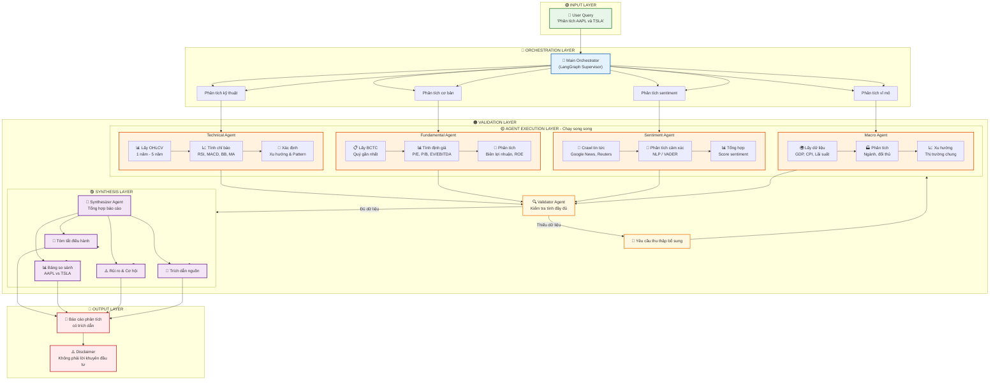

🔍 Giải thích chi tiết từng bước
1️⃣ Input Layer - Nhận yêu cầu
User nhập câu hỏi, ví dụ: "Phân tích cổ phiếu Apple và Tesla, so sánh hiệu quả kinh doanh"

Orchestrator parse câu hỏi, trích xuất: Mã cổ phiếu (AAPL, TSLA), Khung thời gian (1 năm, 5 năm), Loại phân tích (kỹ thuật, cơ bản, cảm xúc)

2️⃣ Orchestration Layer - Điều phối tác vụ
Orchestrator chia nhỏ nhiệm vụ thành các subtask:

Phân tích kỹ thuật → Giao cho Technical Agent

Phân tích cơ bản → Giao cho Fundamental Agent

Phân tích sentiment → Giao cho Sentiment Agent

Phân tích vĩ mô → Giao cho Macro Agent

Tất cả Agent được kích hoạt song song để tiết kiệm thời gian

3️⃣ Agent Execution Layer - Các Agent chuyên biệt hoạt động
Technical Agent (Phân tích kỹ thuật)

Gọi MCP Server (Infoway/Yahoo Finance) → Lấy dữ liệu OHLCV (giá mở, cao, thấp, đóng, khối lượng)

Tính toán chỉ báo: RSI, MACD, Bollinger Bands, Moving Averages

Xác định: Xu hướng (tăng/giảm), vùng kháng cự/hỗ trợ, breakout/consolidation

Fundamental Agent (Phân tích cơ bản)

Gọi MCP Server (SEC EDGAR, Infoway) → Lấy báo cáo tài chính (income statement, balance sheet, cash flow)

Tính toán chỉ số định giá: P/E, P/B, EV/EBITDA, biên lợi nhuận, ROE, ROA

So sánh với trung bình ngành

Sentiment Agent (Phân tích cảm xúc)

Crawl tin tức từ Google News, Reuters, Bloomberg

Dùng NLP (VADER, BERT fine-tuned) để phân tích cảm xúc (positive/negative/neutral)

Tổng hợp sentiment score và xu hướng tin tức

Macro Agent (Phân tích vĩ mô)

Thu thập dữ liệu kinh tế vĩ mô: GDP, CPI, lãi suất, tỷ giá

Phân tích ngành và đối thủ cạnh tranh

Đánh giá ảnh hưởng của yếu tố vĩ mô đến cổ phiếu

4️⃣ Validation Layer - Kiểm tra chất lượng
Validator Agent kiểm tra:

Dữ liệu đã đầy đủ chưa? (Thiếu OHLCV? Thiếu chỉ số định giá?)

Có mâu thuẫn giữa các nguồn không?

Có lỗ hổng logic trong phân tích không?

Nếu thiếu dữ liệu: Quay lại Agent Execution Layer để thu thập bổ sung

Nếu đủ: Chuyển sang Synthesis Layer

5️⃣ Synthesis Layer - Tổng hợp báo cáo
Synthesizer Agent tổng hợp tất cả đầu ra thành báo cáo có cấu trúc:

Tóm tắt điều hành (Executive Summary): Điểm chính, khuyến nghị chung (không phải lời khuyên đầu tư)

Bảng so sánh: AAPL vs TSLA - Kỹ thuật, Cơ bản, Sentiment

Rủi ro & Cơ hội: Điểm mạnh, điểm yếu, cơ hội, rủi ro

Trích dẫn nguồn: Mọi số liệu đều có link/dẫn chứng

6️⃣ Output Layer - Trả về kết quả
Báo cáo phân tích chi tiết

Disclaimer: "Đây là phân tích dữ liệu, không phải lời khuyên đầu tư" - Rất quan trọng để tránh rủi ro pháp lý

💡 Điểm nổi bật của hệ thống này
Song song hóa: 4 Agent phân tích cùng lúc → Tối ưu thời gian

Validation: Kiểm tra chất lượng tự động → Đảm bảo độ chính xác

Tích hợp MCP: Dễ dàng thêm nguồn dữ liệu mới

Trích dẫn nguồn: Minh bạch, giảm ảo giác

Disclaimer: Bảo vệ pháp lý