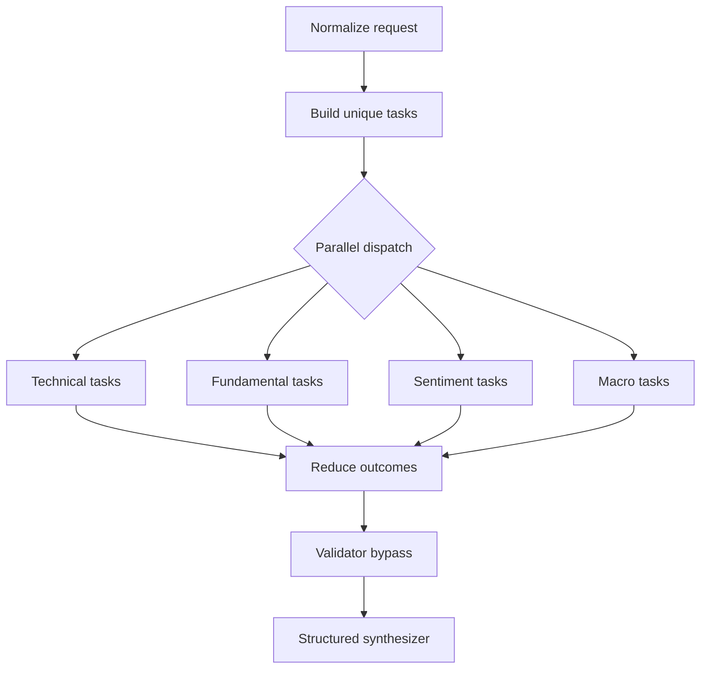

# Orchestration and synthesis

Status: approved
Owner: backend graph and synthesis packages
Depends on: 01-foundation, 03-executor-agents
Consumed by: 05-api-persistence, 06-observability

## Problem

The current supervisor delegates tasks through an LLM conversation, provides no reliable concurrency, and doubles as synthesizer. Structured fields remain empty after execution.

## Goal

Build an explicit LangGraph workflow that normalizes requests, creates tasks, runs requested executors concurrently, bypasses the frozen Validator seam, and returns one structured report.

## Scope

Included: ticker/domain parsing, task planning, Send-based or equivalent LangGraph fan-out, collection reducers, partial failure behavior, Validator bypass, structured synthesis, and comparison.

Non-goals: Validator logic, durable checkpoints, background jobs, cancellation, human approval, and alpha generation.

## Current behavior

The graph is `create_plan -> supervisor`. The plan is unused plain text, routing is model-controlled, and the final response is message prose parsed by object-shape assumptions that do not hold.

## Desired behavior

Routing is deterministic after normalization. Each `(ticker, domain)` task is an explicit unit. Outcomes are collected without last-write-wins loss. The synthesizer receives only validated outcomes and produces the public report schema.

## Architecture impact

The graph is the sole owner of workflow state transitions. Parsing helpers, executor services, and synthesizer remain independently testable.

## Interfaces and contracts

- `TaskSpec`: task ID, run ID, ticker, domain, timeframe, focus areas.
- `GraphState`: normalized request, task list, append-only outcomes, current phase, errors, final report.
- Task identity is `(run_id, ticker, domain)` and duplicate task creation is rejected.
- Synthesizer sections: executive summary, per-ticker analyses, opportunities, risks, comparison, evidence, disclaimer.

## Edge cases and recovery

| Case | Behavior | Recovery |
|---|---|---|
| Duplicate ticker/domain input | Normalize to one task | No user action |
| One task fails | Continue and produce partial report | Resubmit to retry |
| All tasks fail | Skip synthesis narrative and return failed run artifact | Correct failure and resubmit |
| Synthesis schema failure | One bounded retry, then retain outcomes with failed status | Resubmit later |
| One ticker has fewer successful domains | Comparison marks unavailable cells | Inspect domain failure details |

## Acceptance criteria

- `Analyze AAPL and TSLA` becomes eight default tasks.
- Independent tasks execute concurrently where the runtime allows.
- Every task outcome is retained exactly once.
- The Validator seam executes as an explicit no-op with deferred documentation.
- A two-ticker report contains a structured comparison.
- The result is JSON-serializable without converting message objects to strings.
- Partial and total failures follow the documented lifecycle.

## Testing strategy

Test parsing, normalization, task identity, graph routing, reducer behavior, concurrency, partial failures, total failures, synthesis failures, comparison, and JSON serialization with deterministic fake executors.
