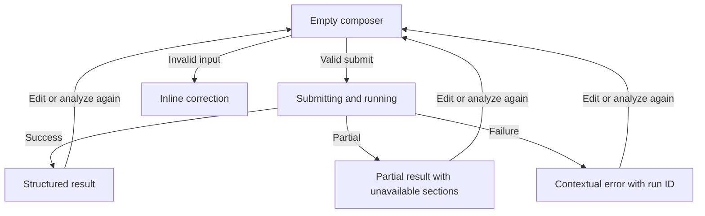

# Next.js analysis dashboard

Status: approved
Owner: frontend application
Depends on: 05-api-persistence
Consumed by: end users and 08-verification-documentation

## Problem

There is no user interface. The current application requires Python execution, hardcodes AAPL, and exposes neither structured results nor useful recovery states.

## Goal

Create a responsive Next.js dashboard where users can submit one or more tickers, inspect structured analysis and comparisons, understand failures, and access raw JSON.

## Scope

Included: Next.js App Router, typed FastAPI client, analysis composer, honest request-level loading state, executive summary, domain views, risks, opportunities, comparison, evidence, execution metadata, raw JSON, JSON download, responsive layout, and a Swiss Industrial Print design system.

Non-goals: authentication, portfolios, live prices, streaming updates, simulated per-agent progress, chart drawing from invented data, trading actions, and marketing pages.

## Current behavior

No frontend project or reusable visual system exists.

## Desired behavior

The default empty screen prioritizes one analysis composer. Successful results reveal a structured workspace. Partial results preserve successful sections and explain unavailable sections. Failures retain user input and provide one clear recovery action.

## Architecture impact

The frontend is a separate local process and depends only on the versioned FastAPI schema. Server Components render the shell; client components are limited to request entry, tabs, theme control, JSON disclosure, copy, and download behavior.

## Design contract

The user selected the `industrial-brutalist-ui` skill. The interface commits to its Swiss Industrial Print archetype and does not mix in the alternate CRT mode.

- Next.js App Router, Tailwind CSS v4, customized shadcn/ui primitives, TanStack Table for comparison behavior, and Phosphor icons.
- Archivo Black for macro headings and IBM Plex Mono for data, metadata, controls, and labels through `next/font`.
- Matte paper `#F4F4F0`, carbon ink `#0B0B0B`, and aviation red `#E61919` as the only accent.
- A rigid 12-column blueprint grid, visible 1px rules, square corners, and no shadows or translucent layers.
- Uppercase structural headings use tight tracking and fluid `clamp()` sizing; compact telemetry uses uppercase monospace with generous tracking.
- Semantic HTML favors `data`, `samp`, `output`, and description lists where those elements reflect the content.
- Syntax markers, revision labels, and crosshairs are allowed only when they encode structure or state.
- Subtle paper grain is acceptable; halftone treatment is limited to nonessential artwork and must honor reduced motion and contrast needs.
- Positive and negative values always include signs, labels, or icons; color is never the only signal.
- CSS transition feedback only; no Motion or GSAP dependency.
- No generic card rows, glassmorphism, gradients, decorative glow, fake charts, hand-rolled SVG icons, rounded containers, or raw JSON as the primary UI.

## Processing flow

## Interface contracts

- Composer accepts free text plus optional ticker and domain controls. Labels remain visible above fields.
- Pressing Analyze creates one request and disables duplicate submission until it resolves.
- Result navigation includes Overview, Technical, Fundamental, Sentiment, Macro, Comparison when applicable, and Evidence.
- Raw JSON is behind a disclosure with copy and download actions.
- API errors map by stable error code rather than parsing human messages.

## Edge cases and recovery

| Case | User experience | Recovery |
|---|---|---|
| Empty request | Inline field error; focus returns to input | Enter a ticker or request |
| Unsupported ticker | Rejected token names supported symbols | Replace or remove ticker |
| Slow synchronous request | Skeletons matching final layout plus elapsed status copy | Wait or retry after network failure |
| Partial result | Persistent partial banner and contextual unavailable sections | Review successful analysis or resubmit |
| Backend unavailable | Connection error retains all input | Start backend and retry |
| No comparison | Comparison navigation is absent, not disabled | Add another ticker |
| Narrow viewport | Single-column analysis and scrollable labeled comparison table | Use tabs or horizontal scroll |

## Acceptance criteria

- A user can submit `Analyze AAPL and TSLA` and see the complete structured result.
- Loading, empty, success, partial, validation-error, server-error, and offline states are implemented.
- Multi-ticker results show a usable comparison without hiding unavailable fields.
- Every visible metric has a label, unit where applicable, and evidence access.
- Raw JSON can be inspected, copied, and downloaded but is not the default presentation.
- Keyboard navigation, focus states, semantic landmarks, contrast, and reduced-motion preferences pass review.
- Desktop and mobile layouts are visually verified against the single light substrate design system.
- The page contains no em dash characters in visible copy.

## Testing strategy

Use component tests for states and interactions, mocked API contract tests, accessibility checks, responsive browser tests, and one browser-driven end-to-end run against the real FastAPI mock backend. Run the full design pre-flight and Lighthouse before verification.
