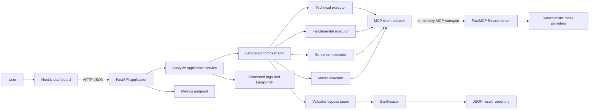
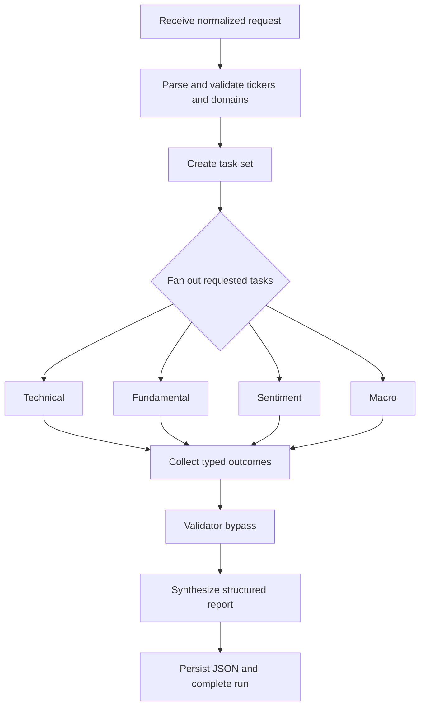
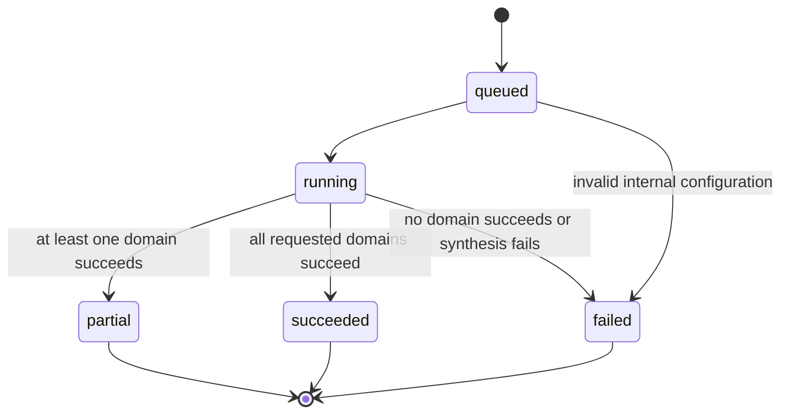
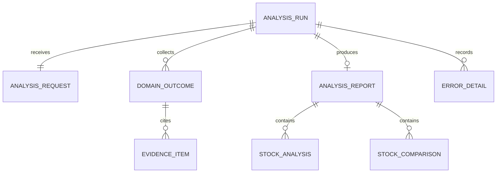
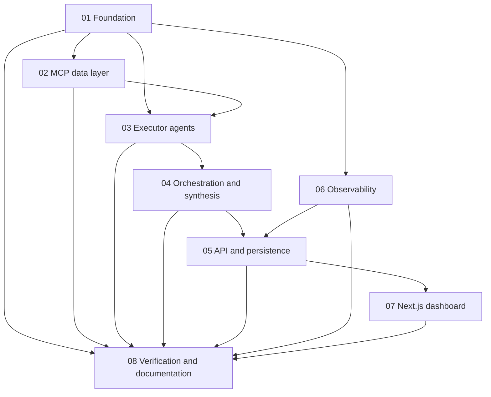

# MVP architecture contract

Status: approved

This document records Phase 2 gap analysis and the Phase 3 architecture proposal. It is a planning contract, not evidence that the application has been implemented.

## Product boundary

The MVP accepts one or more supported stock tickers, runs selected analysis domains against deterministic mock data, synthesizes a structured result, saves the result as JSON, and renders it in a Next.js dashboard.

Included: Python, FastAPI, LangGraph, LangSmith, FastMCP, the OpenAI API with `gpt-5.6-luna`, JSON persistence, structured logs, in-process metrics, and a Next.js frontend.

Excluded: databases, real market providers, crawling, alpha generation, authentication, Validator behavior, Kubernetes, Prometheus/Grafana deployment, and LLM-as-a-judge evaluation.

## Phase 2 gap analysis

| Area | Current state | Target state | Classification |
|---|---|---|---|
| LangGraph | Plan node plus LLM supervisor and three agents | Explicit parse, route, parallel execute, bypass-validator, synthesize graph | REFACTOR |
| Models | OpenRouter configuration and a broken client factory | OpenAI `gpt-5.6-luna` through a LangChain-compatible model adapter | REFACTOR |
| Executors | Technical, fundamental, and sentiment ReAct factories | Four independently invocable typed executor services | REFACTOR |
| Macro | Documented only | Macro executor with sector and competitor implications | ADD |
| Tools | LangChain tools own inline mock payloads | Agents call MCP client; MCP tools call replaceable providers | REFACTOR |
| FastMCP | Unrelated demo server | One finance MCP server exposing six typed tools | REFACTOR |
| Schemas | `TypedDict` state and Markdown messages | Pydantic request, domain, evidence, error, run, and report models | REFACTOR |
| Synthesis | Supervisor narrative only | Dedicated structured synthesizer with comparison and disclaimer | ADD |
| Validator | State fields and aspirational documentation | Explicit bypass seam with no validation behavior | DEFER |
| API | None | FastAPI endpoints for analysis, status, results, and metrics | ADD |
| Persistence | Stale manually generated JSON artifact | Atomic per-run JSON files behind a repository interface | ADD |
| Dashboard | None | Next.js dashboard consuming only FastAPI contracts | ADD |
| Errors | Raw exceptions and one broad catch | Context-rich centralized exception taxonomy and API mapping | ADD |
| Logging | `print` statements | Structured JSON logs with `run_id`, ticker, agent, operation, status, and duration | ADD |
| Metrics | None | Lightweight in-process counters and duration summaries | ADD |
| LangSmith | Partial tracing and latest-run lookup | Exact run metadata propagated through graph and LLM calls | REFACTOR |
| Tests | Import-time external scripts | Deterministic unit, boundary, API, frontend, and end-to-end tests | ADD |
| Documentation | Stale README and conceptual notes | Reproducible setup, run, architecture, and verified reports | REFACTOR |
| Legacy demos | Broken tutorial graph and demo MCP tools | Removed after replacement coverage exists | REMOVE |

## Confirmed decisions

- The backend is a FastAPI application.
- The frontend is a separate Next.js application.
- The frontend communicates only with FastAPI and never imports Python or calls MCP directly.
- The backend and frontend are separate local processes.
- The finance MCP server runs in the backend process through FastMCP's in-memory client transport for this MVP.
- The MCP transport is hidden behind a client adapter so stdio or HTTP can be selected later.
- Executors can run independently and are fanned out concurrently by LangGraph.
- The OpenAI model is configured as `gpt-5.6-luna`; secrets come only from `.env`.
- Results are persisted as JSON files; there is no database.
- The Validator node is represented by a no-op bypass seam and is not implemented.
- Partial domain failure produces a partial report when at least one requested domain succeeds.
- The same client-supplied idempotency key returns the existing run rather than starting duplicate work.

## Service and process boundaries



There are two user-run processes: the Python backend and Next.js frontend. MCP remains a real protocol boundary inside the backend process, avoiding an artificial third service while data is mocked.

## LangGraph responsibilities



The graph owns sequencing, fan-out, collection, state transitions, and failure propagation. Domain calculations live in executors or providers. API serialization and persistence live outside graph nodes.

## Run lifecycle



Runs are immutable after reaching a terminal state. A new request creates a new `run_id` unless its idempotency key already maps to an existing run. There is no resume or retry queue in this iteration. A user can submit a new run after correcting input or configuration.

## Core data relationships



`run_id` is a UUID and stable identity for one execution. Domain outcomes are uniquely identified by `(run_id, ticker, domain)`. JSON files are stored under a configurable output directory using `run_id.json`. Writes use a temporary file followed by an atomic rename. No mutable index is required for the MVP.

## Primary contracts

### Analysis request

```json
{
  "request_text": "Analyze AAPL and TSLA",
  "tickers": ["AAPL", "TSLA"],
  "domains": ["technical", "fundamental", "sentiment", "macro"],
  "timeframe": "1y",
  "focus_areas": [],
  "idempotency_key": "optional-client-key"
}
```

The API accepts `request_text`, explicit fields, or both. Explicit fields win when supplied. Tickers are uppercased, trimmed, deduplicated while preserving order, and checked against the mock-provider catalog.

### Domain outcome

Every executor returns an envelope containing `ticker`, `domain`, `status`, `summary`, `signals`, `opportunities`, `risks`, `evidence`, `duration_ms`, and optional sanitized `error`. Domain-specific details are nested under `data` and validated by a domain schema.

### Structured report

The report contains `run_id`, status, request, executive summary, per-ticker domain sections, opportunities, risks, cross-stock comparison, evidence, execution metadata, generated timestamp, and disclaimer. Markdown may exist in individual narrative fields, but it is never the sole representation.

### API surface

- `POST /api/v1/analyses`: validate and execute one synchronous MVP analysis; return the structured result.
- `GET /api/v1/analyses/{run_id}`: load a persisted result.
- `GET /api/v1/health`: process and configuration health without secrets.
- `GET /api/v1/metrics`: lightweight application metrics in JSON.

The synchronous endpoint is intentional for the mock-data MVP. The frontend shows an honest request-level submitting/running state and receives actual execution metadata in the final response. It does not simulate per-agent progress. Background jobs, polling, SSE, and WebSockets are deferred.

## Failure and recovery contract

| Case | System behavior | Dashboard behavior | Recovery |
|---|---|---|---|
| Empty or malformed request | Return structured 422 error; no run file | Keep entered text and show field guidance | Correct and resubmit |
| Unsupported ticker | Return supported symbols and rejected ticker | Mark the ticker inline | Replace or remove it |
| One MCP tool fails | Mark affected domain failed; continue unrelated tasks | Show partial-result banner and failed section | Submit a new run after correction |
| One executor fails | Preserve successful outcomes and synthesize a partial report | Render successful sections and contextual failure | Retry by submitting again |
| All executors fail | Mark run failed and do not fabricate analysis | Show error summary and run ID | Fix configuration or provider and resubmit |
| Synthesis fails | Mark run failed while retaining domain outcomes in the run artifact | Show domain results with synthesis failure notice | Resubmit after service recovery |
| JSON write fails | Return failure with run context; never claim persistence succeeded | Explain that result could not be saved | Correct output path and resubmit |
| OpenAI unavailable | Retry only SDK-safe transient failures within a small bound | Show service-unavailable guidance | Resubmit later |
| Duplicate idempotency key | Return the prior result | Render the existing run | Start with a new key for a fresh run |

## Logging, tracing, and metrics

- The application creates `run_id` before graph invocation and propagates it through API, graph state, MCP calls, logs, result metadata, and LangSmith trace metadata.
- Logs are JSON records emitted at request, graph, agent, MCP, synthesis, and persistence boundaries.
- Secret values, complete prompts, and raw exception payloads are not logged.
- Metrics are in-process counters and duration aggregates exposed as JSON. Prometheus and OpenTelemetry exporters are deferred.
- LangSmith remains responsible for LLM and graph tracing; application logs remain the operational record.

## Next.js dashboard design contract

The dashboard is a product interface, not a marketing page. The user selected the `industrial-brutalist-ui` skill for the dashboard because it is purpose-built for dense analytical interfaces. The project commits to its **Swiss Industrial Print** archetype; the alternate CRT archetype is not mixed into the interface.

Design read: a declassified equity-research dossier for traders and investors, combining strict Swiss grid logic with the precision of an engineering analysis sheet.

- Next.js App Router with Server Components by default and small client islands for forms, tabs, raw JSON, and theme control.
- Tailwind CSS v4 plus customized shadcn/ui primitives as one owned component system.
- Archivo Black for structural display type and IBM Plex Mono for data and controls through `next/font`.
- One light substrate only: matte paper `#F4F4F0`, carbon ink `#0B0B0B`, and aviation red `#E61919` as the sole accent.
- A rigid 12-column blueprint grid, visible 1px compartment lines, square corners, and no drop shadows or translucency.
- Macro headings use tight uppercase display type; telemetry, metadata, controls, units, and identifiers use compact uppercase mono.
- Density alternates intentionally: compact evidence and comparison tables sit beside large numeric signals and controlled negative space.
- Syntax decoration such as `[ ANALYSIS INPUT ]`, run identifiers, revision labels, and restrained crosshair markers may clarify structure; arbitrary decorative telemetry is prohibited.
- Subtle paper grain may be applied globally. Halftone effects are reserved for empty-state or report-header artwork and must not reduce text or chart legibility.
- No gradients, glass panels, rounded cards, generic three-card rows, fake charts, or hand-built SVG icons.
- Phosphor is the only icon family; icons remain secondary to labels and data.
- Positive and negative values use shape, sign, label, and weight—not green/red alone. Aviation red remains reserved for actions and alerts.
- Charts render only real structured mock values and include accessible textual summaries.
- Loading skeletons mirror final compartments; errors are contextual; the empty state leads directly to ticker entry.
- Mobile preserves the square, ruled visual system in one column, keeps the request action reachable, and exposes comparison content through labeled horizontal scrolling or accessible tabs.

Primary dashboard regions:

1. Compact header with product name, health state, and theme control.
2. Analysis composer with free text, ticker tokens, domain controls, and one `Analyze` action.
3. Request status area showing submitting/running state and the final backend execution summary.
4. Executive summary and high-priority opportunities and risks.
5. Per-ticker analysis workspace with domain navigation.
6. Cross-stock comparison table when two or more tickers are present.
7. Evidence and execution details disclosure.
8. Raw JSON debugging panel with copy and download actions.

## Delivery dependencies



## Planning assumptions

- Supported mock tickers initially include AAPL, TSLA, and MSFT, with genuinely different datasets.
- All four domains run by default when no domains are specified.
- A synchronous API request is acceptable while inputs are mocked and bounded.
- Partial reports are more useful than failing an entire multi-domain request.
- No durable queue, cancellation endpoint, or cross-process status stream is needed for this iteration.

## Approval gate

Approved by the user. Option A (synchronous FastAPI execution) is confirmed. Any later discovery that changes process boundaries, persistence semantics, agent topology, or failure behavior returns to this gate.
